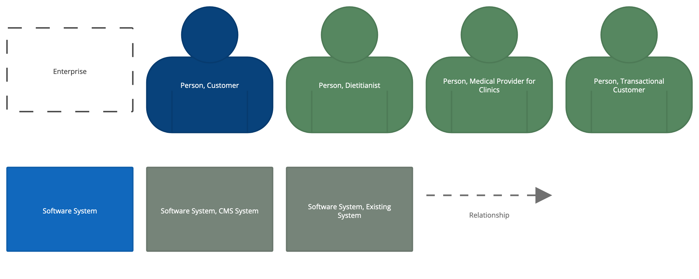
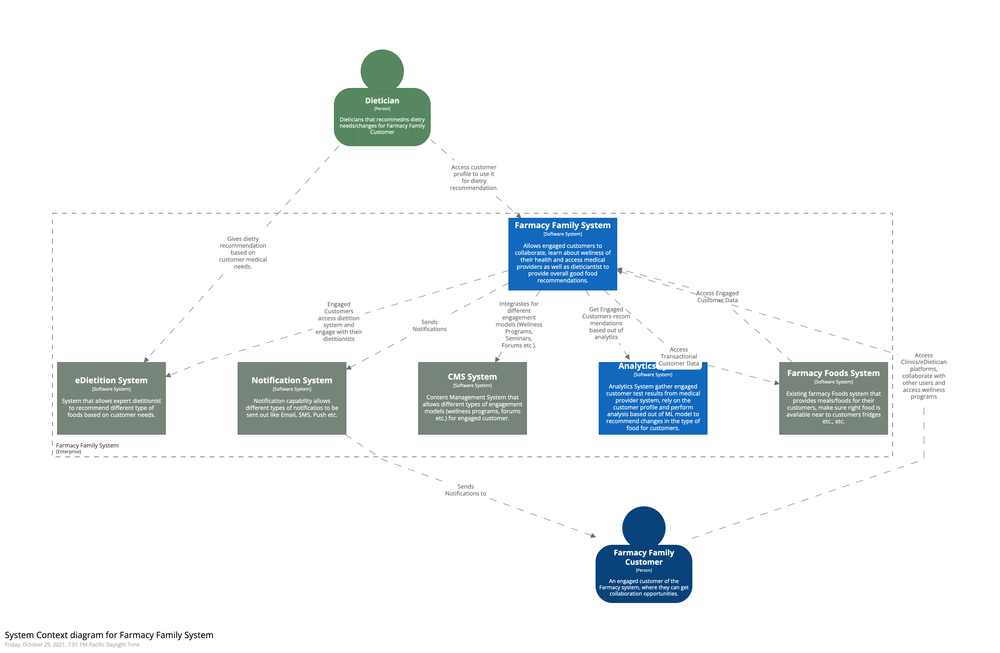

## Architecture Principles
As a team we did come up with few core architecture principles that we decided to stick with as much as possible (for few cases there might be exceptions and will deal it with more rigor). Idea behind these principles is to make sure our architecture and system design aligns existing systems as well as make new integration easier with less time and great quality.

| Principle              | Description                    |
| ---------------------- | ------------------------------ |
| Use an Incremental and Iterative Approach | Start with baseline architecture and then evolve candidate architectures by iterative testing to improve the architecture.
| Separation of Concerns | Divide the components of system into specific features so that there is no overlapping among the components functionality. This will provide high cohesion and low coupling. This approach avoids the interdependency among components of system which helps in maintaining the system easy.
| Define the Communication Protocol between Components | Understand how components will communicate with each other which requires a complete knowledge of deployment scenarios and the production environment.
| Buy vs Build | Prefer to reuse an existing fucntionality if it provides necessary support to address business needs
| Design Exceptions and Exception Handling Mechanism | Defining exceptions in advance, helps the components to manage errors or unwanted situation in an elegant manner. The exception management will be same throughout the system.

## C4 Component Model
C4 is one of the approaches to draw out aechitecture diagrams. It stands for context, containers, components and code. It is a set of hierarchical diagrams that you can use to describe your software architecture at different zoom levels, each useful for different audience The C4 modelling is used here to describe and define architectures in an abstract and simple way.

#### **System Landscape Diagram**

The C4 model provides a static view of a single software system but, in the real-world, software systems never live in isolation. For this reason, and particularly if you are responsible for a collection of software systems, it's often useful to understand how all of these software systems fit together within the bounds of an enterprise. 
Essentially this is a high-level map of the software systems at the enterprise level, with a C4 drill-down for each software system of interest. From a practical perspective, a system landscape diagram is really just a system context diagram without a specific focus on a particular software system. 

Below are the details of the systems/users involved in the landscape diagram.

- Farmacy Family Customer: An engaged customer of the Farmacy system, where they can get collaboration opportunities, welness programs are offered as well as helps from medical providsers & dietitionists regarding food recommendations.

- Farmacy Food Customer: Customer that uses the Farmacy Food system and places transition to purchase meals.

- Medical Provider: Medical providers like Nurses/Doctors that works at Hospitals/Clinics.

- Dietitianist: Dieticians that recommedns dietry needs/changes for Farmacy Family Customer.

- Payment Gateway: It is a third-party payment service provider. SysOps system interact with Payment Gateway
to process customer annual feet

- Notification System: It is the software system which is used to send notifications SMS or Email
to customers and experts.

#### **System Context Diagram**

C4-L1 System Context Diagram is the top-level diagram  of SysOp Squad System and is also the most abstract. It shows the big picture, how different users interact with the SysOp Squad System as a whole, and how the System fits together with other existing software systems

Below are the external users who interact with the system

#### System Container Diagram