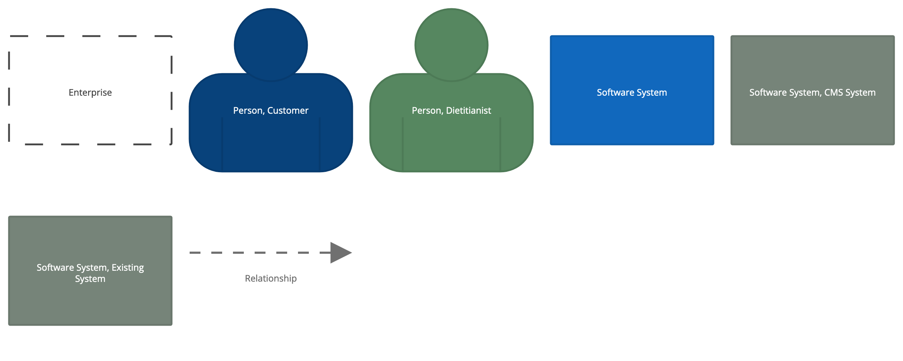
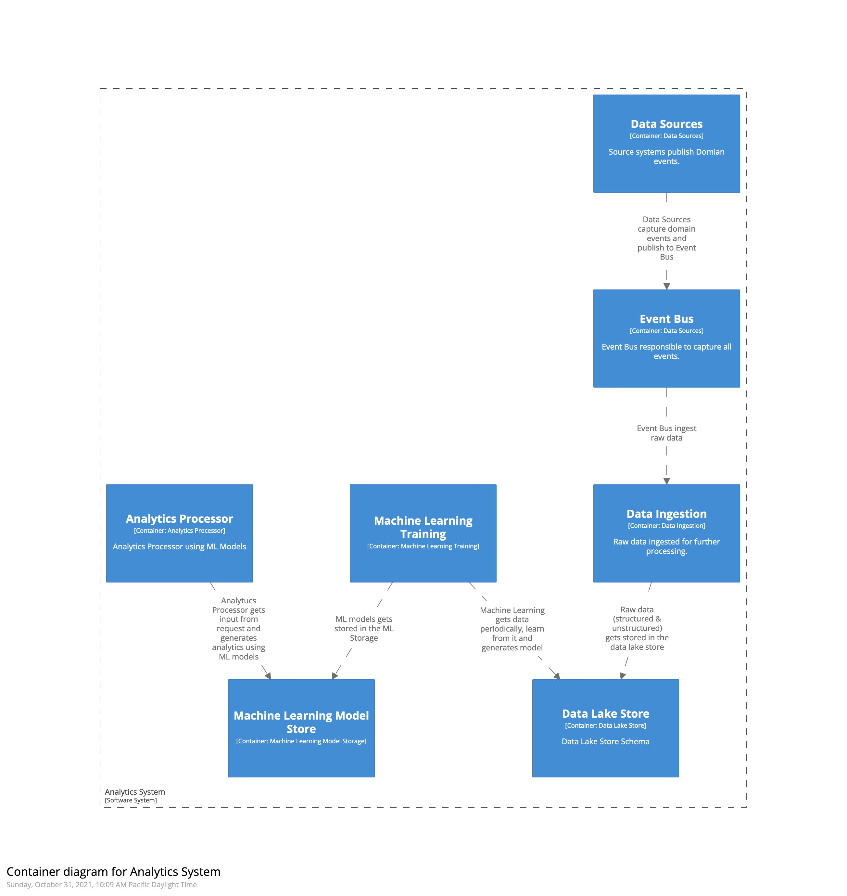

## Architecture Principles
As a team we did come up with few core architecture principles that we decided to stick with as much as possible (for few cases there might be exceptions and will deal it with more rigor). Idea behind these principles is to make sure our architecture and system design aligns existing systems as well as make new integration easier with less time and great quality.

| Principle              | Description                    |
| ---------------------- | ------------------------------ |
| Use an Incremental and Iterative Approach | Start with baseline architecture and then evolve candidate architectures by iterative testing to improve the architecture.
| Separation of Concerns | Divide the components of system into specific features so that there is no overlapping among the components functionality. This will provide high cohesion and low coupling. This approach avoids the interdependency among components of system which helps in maintaining the system easy.
| Define the Communication Protocol between Components | Understand how components will communicate with each other which requires a complete knowledge of deployment scenarios and the production environment.
| Buy vs Build | Prefer to reuse an existing fucntionality if it provides necessary support to address business needs
| Design Exceptions and Exception Handling Mechanism | Defining exceptions in advance, helps the components to manage errors or unwanted situation in an elegant manner. The exception management will be same throughout the system.

## C4 Component Model
C4 is one of the approaches to draw out aechitecture diagrams. It stands for context, containers, components and code. It is a set of hierarchical diagrams that you can use to describe your software architecture at different zoom levels, each useful for different audience The C4 modelling is used here to describe and define architectures in an abstract and simple way.

#### **System Landscape Diagram**

The C4 model provides a static view of a single software system but, in the real-world, software systems never live in isolation. For this reason, and particularly if you are responsible for a collection of software systems, it's often useful to understand how all of these software systems fit together within the bounds of an enterprise. 
Essentially this is a high-level map of the software systems at the enterprise level, with a C4 drill-down for each software system of interest. From a practical perspective, a system landscape diagram is really just a system context diagram without a specific focus on a particular software system. 

Below are the details of the systems/users involved in the landscape diagram.

- Farmacy Family Customer: An engaged customer of the Farmacy system, where they can get collaboration opportunities, welness programs are offered as well as helps from medical providsers & dietitionists regarding food recommendations.

- Farmacy Food Customer: Customer that uses the Farmacy Food system and places transition to purchase meals.

- Medical Provider: Medical providers like Nurses/Doctors that works at Hospitals/Clinics.

- Dietitianist: Dieticians that recommedns dietry needs/changes for Farmacy Family Customer.

- Notification System: It is the software system which is used to send notifications Push, SMS or Email
to customers and experts.

- Farmacy Food System - An existuing system that helps uscotmer to purchase meals and treat their medical problems using Food.

- Farmacy Family System - The new system we are going to build that helps existing Farmacy customers to be more engaged, get better knowledge about different health issues and hosw to treat their condition and at same time allow them to connect with Medical providers and dieticians to get etter insights and food recommendations.

- eDietition System - System that allows expert dietitionist to recommend different type of foods based on customer needs.

- Medical System - System that allows medical providers to work with engaged customers to do testing, run analutics and make recommendsations.

- CMS System - Content Management System that allows different types of engagement models (wellness programs, forums etc.) for engaged customer.

- Analytics System - Analytics System gather engaged customer test results from medical provider system, rely on the customer profile and perform analysis based out of ML model to recommend changes in the type of food for customers.

#### **System Context Diagram**

C4-L1 System Context Diagram is the top-level diagram  of the Famacy Family System and is also the most abstract. It shows the big picture, how different users & systems interact with the Farmacy Family System as a whole, and how the System fits together with other existing software systems.

All the users & systems details already listed above.

#### **Analytics System Container Diagram**

It is the intenral view of how we think Farmacy Data Lake plarform will look like. Its not different than a typical data lake platform and we will be using AWS Data Lake platform to builkd it out. Following definitions of different components inside the analytics platform.
- Data Sources
    - different sources will publish domain events.
        - Farmacy Food System
        - Farmacy Family
        - Medical System (sending engaged customer medical results)
        - eDietition System (send food recommendations)
- Event Bus
    - We will be using Kafka for capturing events 
- Data Ingestion
- Data Lake Store
- Machine Learning Training
- Machine Learning Model Store
- Analytics Processor
    - Process data by running models and returns recommendastion back to the caller.
        - Gegraphical Food Recommendation

#### **Farmacy Family System Container Diagram**